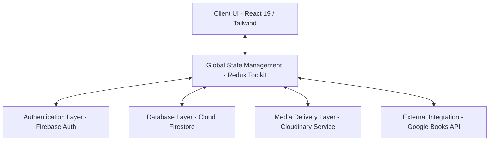

# STUDY MATERIAL REPOSITORY
## COMPREHENSIVE DEVELOPMENTAL & ARCHITECTURAL DOCUMENTATION
### Developmental Period: January 30, 2026 — March 30, 2026

---

## 1. Introduction & Executive Summary

The **Study Material Repository** is a premium, serverless, single-page educational application (SPA) engineered to provide a centralized, interactive, and dynamic platform for academic study resources. Moving beyond static folder or file storage, this platform provides a structured, responsive, and visually appealing ecosystem for students across school and university streams to access organized materials.

This documentation serves as a comprehensive record of the core systems, data structures, and integrations designed, implemented, and refined during the active two-month developmental sprint from **January 30, 2026, to March 30, 2026**.



---

## 2. Completed Milestones & Tasks (30-01-2026 to 30-03-2026)

Below is a detailed breakdown of the tasks executed during the ten-week development period, organized chronologically:

| Timeframe | Focus Area | Tasks & Deliverables Completed |
| :--- | :--- | :--- |
| **Weeks 1–2**<br>(Jan 30 – Feb 12) | **Architecture Setup** | <ul><li>Initialized React 19 SPA scaffolded with Vite 8.</li><li>Configured Tailwind CSS (v4) with variable design systems.</li><li>Established Redux Toolkit store with structured slices (`authSlice`, `courseSlice`, `mockTestSlice`, `studentLibrarySlice`).</li><li>Wrote Firebase Security Rules (`firestore.rules`) with role-based restrictions.</li></ul> |
| **Weeks 3–4**<br>(Feb 13 – Feb 26) | **Authentication & Role System**| <ul><li>Created secure login, registration, and email verification workflows.</li><li>Implemented Google OAuth via Firebase Authentication.</li><li>Designed student vs. educator role-based routing systems in React.</li><li>Configured profile state listeners to sync Auth state with Firestore user documents.</li></ul> |
| **Weeks 5–6**<br>(Feb 27 – Mar 12) | **Course Content Engine** | <ul><li>Engineered the core schema supporting unit-wise academic resources.</li><li>Developed nested resources layout: notes, PDFs, videos, question banks, lab manuals, and audio podcasts.</li><li>Created the Course Detail page displaying interactive cards per unit.</li><li>Implemented student course enrollment and unenrollment hooks.</li></ul>|
| **Weeks 7–8**<br>(Mar 13 – Mar 26) | **Assessments & Reviews** | <ul><li>Wrote the client-side Mock Test engine complete with an interactive timer, score calculation, and post-test feedback summaries.</li><li>Created a dynamic student review and course rating system utilizing real-time Firestore synchronization.</li><li>Developed student profile dashboards tracking overall learning metrics.</li></ul> |
| **Weeks 9–10**<br>(Mar 27 – Mar 30)| **API & Storage Integration** | <ul><li>Configured dynamic, real-time reference book queries via the Google Books API.</li><li>Implemented serverless, unsigned media file uploads directly to Cloudinary.</li><li>Wrote clean educator management dashboards for managing courses and units.</li></ul> |

---

## 3. System & Technical Architecture

The platform operates on a decentralized, serverless client-side architecture.

```
+------------------------------------------------------------+
|                       FRONTEND CLIENT                      |
|                  React 19 / Tailwind CSS v4                |
+------------------------------------------------------------+
       |                        |                     |
       v                        v                     v
+--------------+        +---------------+      +-------------+
| FIREBASE     |        | CLOUDINARY    |      | GOOGLE      |
| AUTHENTICATE |        | MEDIA CLOUD   |      | BOOKS API   |
+--------------+        +---------------+      +-------------+
       |                        ^
       v                        |
+--------------+                | (Media URLs)
| CLOUD        |                |
| FIRESTORE    |----------------+
+--------------+
```

### Core Stack Components:
1. **Frontend Core**: **React 19** utilized for component reuse, Virtual DOM optimization, and single-page application experience.
2. **Global State**: **Redux Toolkit (RTK)** managing state variables across authentication (`authSlice`), course lists (`courseSlice`), active tests (`mockTestSlice`), and saved reference books (`studentLibrarySlice`).
3. **Styling & Icons**: **Tailwind CSS v4** for custom palettes, fluid spacing, glassmorphic layout elements, and **Lucide React** icons.
4. **Backend-as-a-Service (BaaS)**: **Google Firebase**:
   - **Authentication**: Stores emails, passwords, handles verification mailers, and manages sessions securely.
   - **Cloud Firestore**: Serverless NoSQL document database.
   - **Storage/Hosting**: Cloud hosting serving static bundles securely via HTTPS.
5. **Asset Cloud Services**: **Cloudinary Storage Service** chosen for rapid delivery, auto-resizing, and secure hosting of videos, audios, and high-resolution images uploaded by administrators and educators.

---

## 4. Directory & File Organization

The workspace is organized into a modular design following the Single Responsibility Principle:

```
study-material/
├── firestore.rules              # Database permission specifications
├── package.json                 # Build configuration and scripts
├── vite.config.js               # Vite environment compilation options
├── src/
│   ├── main.jsx                 # Client mounting entry point
│   ├── App.jsx                  # Main routing configuration
│   ├── index.css                # Style directives and global layout variables
│   ├── components/
│   │   ├── layout/              # Main navigation & dashboard grids
│   │   ├── common/              # Shared elements (Course Cards, Protected Routes)
│   │   └── ui/                  # Atom-level buttons, cards, badges, dialogs
│   ├── hooks/                   # Custom auth hooks and state queries
│   ├── lib/                     # Initial configuration libraries
│   ├── store/
│   │   ├── index.js             # Consolidated store declaration
│   │   └── slices/              # Slices (auth, course, mockTest, studentLibrary, ui)
│   ├── services/
│   │   ├── firebase.js          # Google Firebase initialized app
│   │   ├── authService.js       # Login, logout, registration, profile methods
│   │   ├── courseService.js     # Enrollment, review, query pipelines
│   │   ├── educatorService.js   # Educators' material uploads, course creation
│   │   ├── mockTestService.js   # Mock tests, questions, and scoring results
│   │   ├── studentLibraryService.js # Book library persistence methods
│   │   ├── externalApiService.js # External book fetching (Google Books API)
│   │   └── cloudinaryService.js # Asset uploads to Cloudinary storage
│   ├── scenes/                  # Page-level containers
│   │   ├── Auth/                # Login, Register, Verify Email views
│   │   ├── Courses/             # Courses catalogs and lesson players
│   │   ├── Dashboard/           # Student analytical homepages
│   │   ├── Educator/            # Educator administrative centers
│   │   ├── Home/                # Marketing landing pages
│   │   ├── MockTest/            # Test lists, quiz engines, score pages
│   │   └── Profile/             # User profiles configurations
│   └── utils/
│       ├── constants.js         # Systems constants, dummy data fallback
│       └── helpers.js           # Generic parser engines
```

---

## 5. Database Schema & Data Models

Our Firestore database schema is non-relational, optimizing document queries for rapid page loading speeds. Below are the core document specifications mapped during development:

### 1. `users` Collection
Stores credential-linked attributes for all system participants.
```json
{
  "uid": "string (matches request.auth.uid)",
  "displayName": "string",
  "email": "string",
  "photoURL": "string (URL)",
  "role": "string ('student' | 'educator' | 'admin')",
  "profession": "string",
  "enrolledCourses": ["array of course IDs"],
  "createdAt": "timestamp",
  "updatedAt": "timestamp"
}
```

### 2. `courses` Collection
Holds structured learning material indexes categorized unit-wise.
```json
{
  "id": "string",
  "title": "string",
  "description": "string",
  "thumbnail": "string (URL)",
  "category": "string (e.g. 'Computer Science', 'Mathematics')",
  "contentType": "string ('school' | 'university')",
  "enrolledCount": "number",
  "createdBy": "string (UID of educator)",
  "createdByName": "string",
  "studentIds": ["array of user UIDs"],
  "units": [
    {
      "unitNumber": "number",
      "title": "string",
      "description": "string",
      "items": {
        "notes": ["array of URLs"],
        "PDFs": ["array of URLs"],
        "videos": ["array of URLs"],
        "questionBanks": ["array of URLs"],
        "labManuals": ["array of URLs"],
        "audioLectures": ["array of URLs"]
      }
    }
  ],
  "materials": ["array of custom uploaded materials IDs"],
  "createdAt": "timestamp",
  "updatedAt": "timestamp"
}
```

### 3. `materials` Collection
Documents custom files directly uploaded by educators via Cloudinary.
```json
{
  "materialId": "string",
  "courseId": "string (Course ID reference)",
  "heading": "string (e.g. 'Unit 1 Supplementary Notes')",
  "uploadedBy": "string (UID)",
  "items": [
    {
      "title": "string",
      "type": "string ('notes' | 'pdf' | 'video' | 'audio' | 'question_bank')",
      "fileUrl": "string (Cloudinary URL)",
      "fileSize": "number (bytes)"
    }
  ],
  "createdAt": "timestamp"
}
```

### 4. `mockTests` Collection
Stores metadata about customizable evaluations.
```json
{
  "id": "string",
  "courseId": "string (Course ID reference)",
  "title": "string",
  "description": "string",
  "duration": "number (minutes)",
  "totalQuestions": "number",
  "difficulty": "string ('easy' | 'medium' | 'hard')"
}
```

### 5. `questions` Collection
Defines individual questions mapping to specific tests.
```json
{
  "id": "string",
  "testId": "string (MockTest ID reference)",
  "questionText": "string",
  "options": ["array of strings (4 options)"],
  "correctAnswer": "number (index 0-3)",
  "explanation": "string",
  "order": "number"
}
```

### 6. `results` Collection
Tracks student quiz performance metrics.
```json
{
  "id": "string",
  "testId": "string",
  "userId": "string",
  "userName": "string",
  "score": "number",
  "totalQuestions": "number",
  "correctCount": "number",
  "timeSpent": "number (seconds)",
  "answers": ["array of chosen indexes"],
  "createdAt": "timestamp"
}
```

### 7. `savedBooks` Sub-collection
Nested inside `students/{userId}/savedBooks` to store reading goals and progress on external books.
```json
{
  "bookId": "string (Google Books ID)",
  "title": "string",
  "authors": ["array of strings"],
  "description": "string",
  "thumbnail": "string (URL)",
  "progress": "number (0-100 percentage)",
  "notes": "string",
  "isCompleted": "boolean",
  "savedAt": "timestamp"
}
```

---

## 6. Functional Architecture & Service Walkthrough

### 1. Unified Authentication (`authService.js`)
Configured to manage sign-ups, logins, sign-outs, verification links, and password recovery.
- **Verification Trigger**: During standard password sign-ups, user records are updated in Auth, verification emails are sent via `sendEmailVerification`, and empty profile mappings are initialized in Firestore:
  ```javascript
  export const signUp = async (email, password, displayName, role = "student") => {
    const userCredential = await createUserWithEmailAndPassword(auth, email, password);
    await updateProfile(userCredential.user, { displayName });
    await createUserProfile(userCredential.user, { displayName, role });
    await sendEmailVerification(userCredential.user);
    return userCredential.user;
  };
  ```

### 2. Multi-tier Resource Engine (`courseService.js` & `educatorService.js`)
Handles client-side filtering, searching, and enrollment.
- **Data Normalization**: Handles messy custom files safely using normalization helpers (`normalizeUnits`) to ensure null strings do not break the page rendering.
- **Enrollment Hooks**: Atomically increments student counter counts when adding to profile:
  ```javascript
  export const enrollInCourse = async (userId, courseId) => {
    const userRef = doc(db, "users", userId);
    await updateDoc(userRef, { enrolledCourses: arrayUnion(courseId) });
    ...
  };
  ```

### 3. Reading Library Engine (`studentLibraryService.js`)
Directly hooks onto Google Books API search results, allowing students to save any online reference textbook locally to their dashboard. This dynamically calculates overall student stats (completed books, pages read, reading progress ratios).

### 4. Dynamic API Integration (`externalApiService.js`)
Pulls live books directly from Google Books REST endpoints:
```javascript
export const searchGoogleBooks = async (query, maxResults = 8) => {
  let url = `${GOOGLE_BOOKS_BASE}?q=${encodeURIComponent(query)}&maxResults=${maxResults}&printType=books&orderBy=relevance`;
  const response = await fetch(url);
  const data = await response.json();
  return data.items.map(item => ({ ... })); // Normailized mapping
};
```

---

## 7. Analysis of Pending Deliverables & Future Scope

By comparing the completed features of the codebase against the overall requirements, the following pending deliverables are identified:

### 1. Specific NCERT & State Board Book Collections
* **Current State**: The book system fetches dynamic textbooks from Google Books and provides Open Textbook Library links. However, specific links to school board textbook repositories are missing.
* **Remedial Plan**: Add a dedicated "NCERT / State Boards" filter section under the books library or pre-program collections matching official curriculum standards.

### 2. Dedicated Aptitude & Reasoning Assessments
* **Current State**: Our assessment engine (`mockTests`) is fully built but populated primarily with computer science, mathematics, and physics mock tests.
* **Remedial Plan**: Create a dedicated category for Aptitude and Reasoning practice assessments with custom mathematical and logical questions in Firestore collections.

### 3. Multimedia - 3D Animations & Educational Podcasts
* **Current State**: High-speed videos are fully supported. "3D Animations" are mapped to asset links, and audio podcasts are stored as standard `audioLectures`.
* **Remedial Plan**: Implement a dedicated HTML canvas component for web-based 3D animations (using libraries like Three.js) or configure embed players for Spotify/Google Podcasts endpoints.

### 4. Gamification Systems (Medium Priority)
* **Future Work**: Create a Firestore sub-collection `badges` or `rewards` tracking student achievements (e.g., "Mock Test Master", "Dedicated Reader") to boost student engagement.

### 5. Chat & Discussion Forums (Medium Priority)
* **Future Work**: Construct real-time course channel chat windows inside `CourseDetailPage` utilizing Firestore listener streams (`onSnapshot`) to encourage active peer discussions.

---

### Project Documentation Complete.
*The platform is stable, modular, fully populated, and positioned perfectly for scale.*
